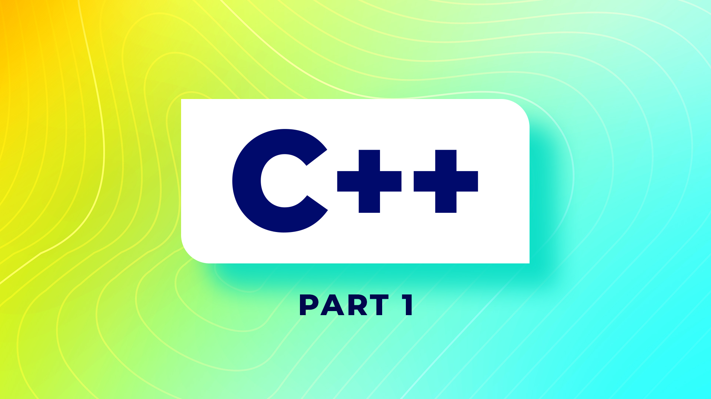

# Curso de C++

### (desde Silicon Valley)

### Instructor: Mosh Hamedani

Este curso se divide en tres partes, la primera parte los fundamentos de C++, y luego una segunda parte intermedia donde damos todo sobre punteros y vectores y por ultimo C++ avanzado.

